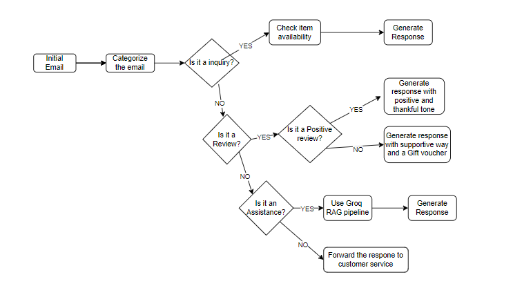

# Automatic Email Reply System Flowchart

## Overview

This documentation explains the flowchart of the Automatic Email Reply System for a Film Equipment Rental Service. The system categorizes incoming emails into different types and generates appropriate responses using a combination of predefined rules and the Groq RAG pipeline.

## Flowchart Explanation

The flowchart provides a visual representation of how the system processes incoming emails. Here’s a detailed step-by-step explanation:

1. **Initial Email**:
    - The process begins when an email is received by the system.

2. **Categorize the Email**:
    - The system categorizes the email based on its content. This involves checking for specific keywords and patterns to determine the type of the email.

3. **Inquiry Handling**:
    - **Check if it's an Inquiry**:
        - The system checks if the email is an inquiry about the availability or rental prices of equipment.
        - **YES**: If the email is an inquiry:
            - **Check Item Availability**: The system queries the SQLite database to check the availability of the requested item.
            - **Generate Response**: The system generates a response based on the item's availability and rental price.
        - **NO**: If the email is not an inquiry, the system proceeds to the next check.

4. **Review Handling**:
    - **Check if it's a Review**:
        - The system checks if the email is a review.
        - **YES**: If the email is a review:
            - **Check if it's a Positive Review**: The system analyzes the sentiment of the review.
                - **YES**: If the review is positive:
                    - **Generate Response with Positive and Thankful Tone**: The system generates a positive and thankful response, encouraging the customer to share their experience on social media.
                - **NO**: If the review is negative:
                    - **Generate Response with Supportive Way and Gift Voucher**: The system generates a supportive response and offers a gift voucher to compensate for the negative experience.
        - **NO**: If the email is not a review, the system proceeds to the next check.

5. **Assistance Request Handling**:
    - **Check if it's an Assistance Request**:
        - The system checks if the email is a request for assistance or troubleshooting help.
        - **YES**: If the email is an assistance request:
            - **Use Groq RAG Pipeline**: The system uses the Groq RAG pipeline to generate a response. This involves sending the email content to the Groq API and retrieving a generated solution.
            - **Generate Response**: The system generates a response based on the solution provided by the Groq RAG pipeline.
        - **NO**: If the email is not an assistance request, the system forwards the email to customer service for manual handling.

6. **General Handling**:
    - **Forward to Customer Service**:
        - Emails that do not fit into any of the above categories are forwarded to customer service for further evaluation and response.

## Conclusion

The flowchart and this documentation provide a comprehensive understanding of how the Automatic Email Reply System processes incoming emails and generates responses. The combination of predefined rules and the Groq RAG pipeline ensures that each email is handled appropriately, improving customer service efficiency and effectiveness.

## Output

