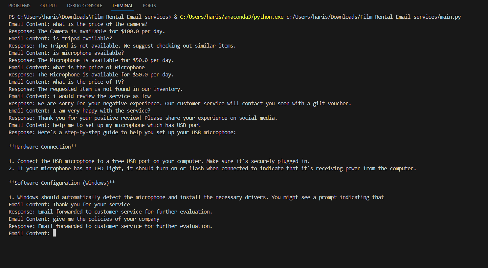

# Automatic Email Reply System for Film Equipment Rental Service

## Project Overview

This project is an Automatic Email Reply System designed for a Film Equipment Rental Service. The system uses an SQLite database to manage the inventory and availability of rental equipment. It employs the Groq RAG (Retrieve and Generate) pipeline to classify incoming emails and generate appropriate responses based on the content of the emails.

## Features

- **Inquiry Handling**: Responds to inquiries about the availability and rental prices of equipment.
- **Review Handling**: Processes and responds to positive and negative reviews.
- **Assistance Request Handling**: Provides support and troubleshooting help using the Groq RAG pipeline.
- **General Handling**: Forwards emails to customer service if they do not fit into the above categories.

## Setup Instructions

### Prerequisites

- Python 3.6 or higher
- Groq API Key
- SQLite

### Installation

1. **Clone the Repository**:
    ```sh
    git clone https://github.com/2003HARISH/-Automatic-Email-Reply-System-for-Film-Equipment-Rental-Service.git
    cd Automatic-Email-Reply-System-for-Film-Equipment-Rental-Service
    ```

2. **Install Required Packages**:
    ```sh
    pip install groq sqlite3
    ```

3. **Set Up SQLite Database**:
    Create a database file `film_equipment.db` and run the following SQL script to create the `equipment` table and insert sample data.

    ```sql
    -- Create the equipment table
    CREATE TABLE IF NOT EXISTS equipment (
        id INTEGER PRIMARY KEY AUTOINCREMENT,
        name TEXT NOT NULL,
        availability BOOLEAN NOT NULL,
        price REAL NOT NULL
    );

    -- Insert sample data into the equipment table
    INSERT INTO equipment (name, availability, price) VALUES
    ('Camera', True, 100.0),
    ('Tripod', False, 25.0),
    ('Microphone', True, 50.0),
    ('Lighting Kit', True, 75.0);
    ```

4. **Set Groq API Key**:
    Set the `GROQ_API_KEY` environment variable in your shell or include it in your script:
    ```sh
    export GROQ_API_KEY='your_groq_api_key'
    ```

### Database Schema

The `equipment` table schema is as follows:

| Column      | Data Type | Description                           |
|-------------|------------|---------------------------------------|
| `id`        | INTEGER    | Primary key, auto-incremented         |
| `name`      | TEXT       | Name of the equipment                 |
| `availability` | BOOLEAN  | Availability status (True = available, False = not available) |
| `price`     | REAL       | Rental price per day                  |

### Project Structure


## RAG Pipeline Explanation

The RAG (Retrieve and Generate) pipeline used in this project leverages Groq's LLM capabilities to classify emails and generate contextually appropriate responses. Here’s how it works:

1. **Initialize the Groq Client**:
    ```python
    import os
    from groq import Groq

    client = Groq(api_key=os.environ.get("GROQ_API_KEY"))
    ```

2. **Classify Email Content**:
    The email content is classified into categories like inquiries, reviews, and assistance requests using keyword matching with regex patterns.

3. **Model Architecture**:
    - **Model Name**: `llama3-70b-8192`
    - **Temperature**: `1.2`
        - This parameter controls the creativity of the responses. A higher temperature results in more diverse outputs.
    - **Max Tokens**: `100`
        - This defines the maximum length of the generated response in tokens.

    Here’s an example of using these parameters to generate a response:
    ```python
    system_prompt = {
        "role": "system",
        "content": "You are a helpful assistant. You reply with very short answers."
    }

    chat_history = [system_prompt]

    while True:
        user_input = input("You: ")

        chat_history.append({"role": "user", "content": user_input})

        response = client.chat.completions.create(
            model="llama3-70b-8192",
            messages=chat_history,
            max_tokens=100,
            temperature=1.2
        )

        chat_history.append({
            "role": "assistant",
            "content": response.choices[0].message.content
        })

        print("Assistant:", response.choices[0].message.content)
    ```

4. **Handle Inquiries**:
    If the email is classified as an inquiry, the system extracts the item name, checks its availability in the SQLite database, and generates a response based on the availability.

5. **Handle Reviews**:
    For review emails, the system detects positive or negative sentiment and generates an appropriate response.

6. **Handle Assistance Requests**:
    For assistance requests, the system uses the Groq RAG pipeline to generate responses by sending the email content to the Groq API and retrieving a generated solution.

7. **Forward Unclassified Emails**:
    Emails that do not fit into any of the above categories are forwarded to customer service for manual handling.
## Output



## Usage

To run the email reply system, execute the `main.py` script:

```sh
python main.py

## Usage

To run the email reply system, execute the `main.py` script:

```sh
python database_setup.py
python main.py

